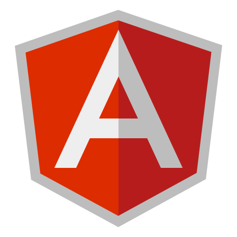

# Hello, Everyone

<h3 align="center" style="color: #fff">💖Visit Count💖</h3>
 

  

 

  

# My Main Stack

  
  
  
  
  
  
  

# Languages & Framework

<table align="center">
  <tr>
    <td align="center" width="96">
        
       React
    </td>
    <td align="center" width="96">
      
       Python
    </td>
    <td align="center" width="96">
        
       JavaScript
    </td>
    <td align="center" width="96">
        
       C++
    </td>
    <td align="center" width="96">
        
       Webpack
    </td>
    <td align="center" width="96">
        
       MySQL
    </td>
    <td align="center" width="96">
        
       TypeScript
    </td>
    <td align="center" width="96">
        
       AWS
    </td>
    <td align="center" width="96">
        
       C#
    </td>
  </tr>
  <tr>
  <td align="center" width="96">
        
       Django
    <td align="center" width="96">
        
       Github
    </td>
    <td align="center" width="96"> 
        
       Git
    </td>
    <td align="center"  width="96">
        
       Laravel
    </td>
    <td align="center"  width="96">
        
       HTML5
    </td>
    <td align="center" width="96">
        
       CSS
    </td>
    <td align="center"  width="96">
        
       Bootstrap
    </td>
    <td align="center" width="96">
        
       Tailwind
    </td>
    <td align="center" width="96">
        
       jQuery
    </td>
  </tr>
 <tr>
      <td align="center" width="96">
        
       MongoDB
    </td>
        <td align="center" width="96">
        
       Nodejs
      </td>
      </td>
    <td align="center" width="96">
        
       PHP
    </td>
              <td align="center" width="96">
        
       WordPress
    </td>
              <td align="center" width="96">
        
       Vue
    </td>
              <td align="center" width="96">
        
       Sass
    </td>
              <td align="center" width="96">
        
       GraphQL
    </td>
    <td align="center" width="96">
        
       PostgreSQL
    </td>
 </tr>
</table>
  

# Welcome

  
  
  

### Hi there 👋

<!--
**SweetCoding115/SweetCoding115** is a ✨ _special_ ✨ repository because its `README.md` (this file) appears on your GitHub profile.

Here are some ideas to get you started:

- 🔭 I’m currently working on ...
- 🌱 I’m currently learning ...
- 👯 I’m looking to collaborate on ...
- 🤔 I’m looking for help with ...
- 💬 Ask me about ...
- 📫 How to reach me: ...
- 😄 Pronouns: ...
- ⚡ Fun fact: ...
-->
<!--
- 🔭 I’m currently working as a Freelancer
- 🤔 I’m looking for opportunity to be a member of an agency or a team
- 💡 Open to collaborating on projects and innovative ideas.
- 💬 Ask me about problems arising in development of your site
- 😄 You can find me when you have any trouble.
-->

- 💻 Experience in React, Angular, Vue, Nodejs, and JavaScript
- 🚀 Developed scalable web applications using React and Node.js
- 🔧 Familiar in database design (SQL, MongoDB)
- 📈 Proven track record in optimizing code for performance
- 🏆 Recognized for outstanding problem-solving skills
- 📚 Dedicated to continuous learning in tech trends
- 🔗 Let's connect! Open to new opportunities and collaborations. 

<!--
## How to Reach Me

  
  
  
  

-->
